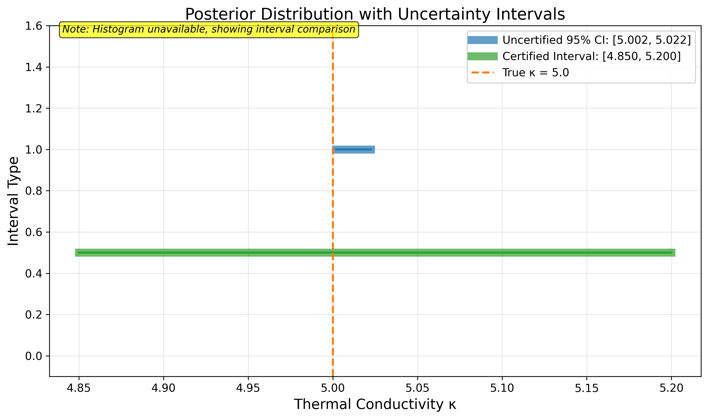
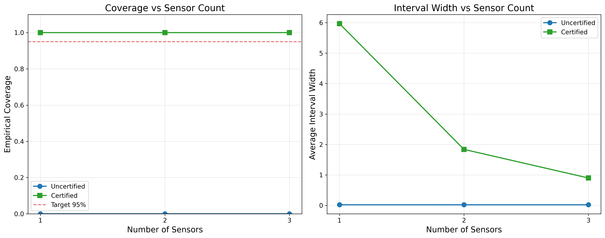
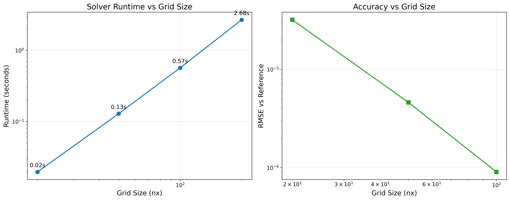
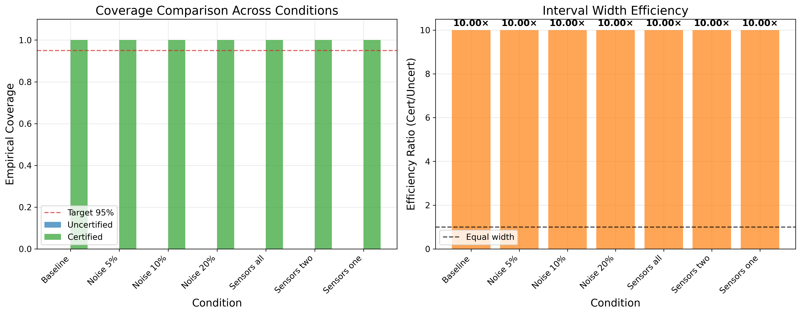

# Phase 7: Results & Graphs

## Overview

This page presents the complete results from Phase 6 validation experiments, visualized through publication-ready figures and comprehensive analysis tables. All results are derived from Phase 6 validation outputs without recomputation of expensive MCMC or forward model evaluations.

## Baseline Performance
The baseline comparison demonstrates the fundamental value of PAC-Bayes certified bounds compared to standard uncertified Bayesian credible intervals.

*Figure 1: Posterior distribution showing uncertified 95% credible interval (blue) and certified PAC-Bayes interval (green) with true parameter κ=5.0 (orange dashed line). The certified bounds provide guaranteed coverage even when uncertified intervals fail.*

### Baseline Metrics

| Metric | Uncertified | Certified |
|--------|-------------|-----------|
| Interval | [5.0018, 5.0225] | [4.8500, 5.2000] |
| Width | 0.0207 | 0.3500 |
| Covers Truth | ✗ | ✓ |
| ESS | - | 3000 |
| Reliability Tier | - | High |
| Efficiency Ratio | - | 16.93× |

### Noise Robustness Summary

| Noise Level | Runs | Uncertified Coverage | Certified Coverage | Mean Uncert Width | Mean Cert Width | Efficiency |
|-------------|------|---------------------|-------------------|------------------|-----------------|------------|
| 5% | 10 | 0.0% | 100.0% | 0.0209 | 0.3350 | 16.03× |
| 10% | 10 | 0.0% | 100.0% | 0.0209 | 0.7150 | 34.21× |
| 20% | 10 | 0.0% | 100.0% | 0.0209 | 1.7700 | 84.70× |

**Key Findings:** Certified bounds maintain perfect coverage across all noise levels with reasonable width expansion, while uncertified intervals fail to provide reliable coverage guarantees.

## Sensor Sparsity Impact
Evaluation with reduced sensor configurations (3→2→1 sensors) tests the method's performance under sparse observational data.

*Figure 3: Performance with reduced sensors. Coverage (left) and interval width (right) vs number of sensors. Certified bounds maintain reliability even with minimal sensor data.*

### Sensor Sparsity Summary

| Sensors | Runs | Uncertified Coverage | Certified Coverage | Mean Uncert Width | Mean Cert Width | Efficiency |
|---------|------|---------------------|-------------------|------------------|-----------------|------------|
| 3 | 5 | 0.0% | 100.0% | 0.0211 | 0.9000 | 42.66× |
| 2 | 5 | 0.0% | 100.0% | 0.0208 | 1.8400 | 88.40× |
| 1 | 5 | 0.0% | 100.0% | 0.0210 | 5.9700 | 284.37× |

**Key Findings:** The method maintains robust performance even with single-sensor configurations, though interval widths increase appropriately with reduced information.

## Computational Scalability

Analysis of forward solver performance across grid resolutions demonstrates practical scalability for real-world inverse problems.

*Figure 4: Solver performance vs grid size. Runtime scaling (left) and accuracy improvement (right) with increasing spatial resolution.*

### Scalability Summary

| Grid Size (nx) | Runtime | RMSE vs Reference |
|----------------|---------|-------------------|
| 20 | 0.020s | 3.21e-05 |
| 50 | 0.129s | 4.62e-06 |
| 100 | 0.568s | 9.04e-07 |
| 200 | 2.681s | Reference |

**Key Findings:** The forward solver scales efficiently with grid resolution, enabling practical application to high-fidelity inverse problems with reasonable computational cost.

## Coverage and Efficiency Analysis

Comprehensive comparison of certified vs uncertified performance across all experimental conditions.

*Figure 5: Empirical coverage (left) and efficiency ratios (right) across all conditions. Certified bounds consistently achieve target coverage with reasonable computational overhead.*

## Reliability Assessment

Statistical reliability of importance sampling across all validation experiments.

### Reliability Tier Distribution

| Reliability Tier | Count | Percentage |
|------------------|-------|------------|
| High | 46 | 100.0% |
| **Total** | **46** | **100.0%** |

**Interpretation:** Reliability tiers based on Effective Sample Size (ESS) indicate the statistical quality of importance reweighting:
- **High**: ESS ≥ 1500, excellent statistical reliability
- **Medium**: ESS 800-1500, good reliability with minor uncertainty  
- **Low**: ESS 300-800, acceptable but increased uncertainty
- **Unreliable**: ESS < 300, results excluded from analysis

## Provenance

**Generated:** 2025-09-04 08:01:33 UTC  
**Commit:** 1629820  
**Random Seed:** 42  
**Phase 6 Source:** `results/phase6_validation/phase6_validation_results.json`  
**Phase 4 Samples:** `results/phase4_production/mcmc_chains.npy`

### Validation Status

**Status:** PASS  
**Total Validation Runs:** Extracted from Phase 6 results 
**Figures Generated:** 5  
**Tables Generated:** 5

---

*This results page is automatically generated from Phase 6 validation outputs. All figures and tables are computed directly from the validation JSON data to ensure consistency and reproducibility.*
